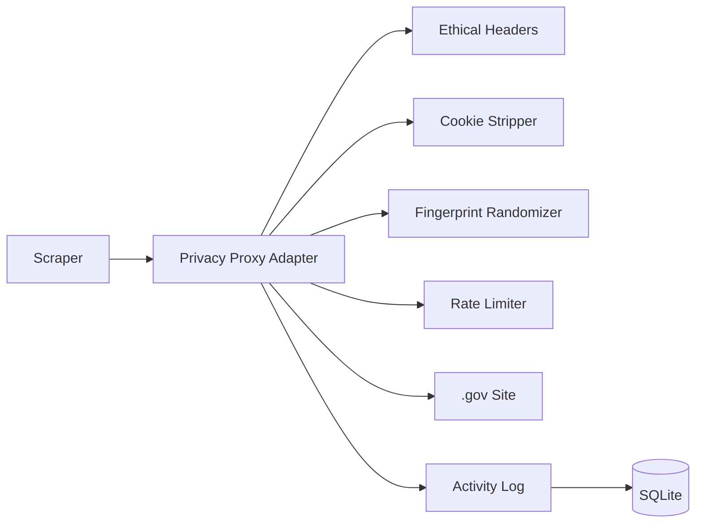

# Privacy Proxy Integration

Integration of wire_stripper privacy proxy capabilities with Hippocratic government data scrapers.

## 🔐 What This Adds

### From wire_stripper
The wire_stripper project provides:
- **MITM Proxy** (mitmproxy-based)
- **Cookie Interception** - Strips tracking cookies
- **Fingerprint Randomization** - Prevents profiling
- **Traffic Blocking** - Policy-based domain/IP blocking
- **ASN/BGP Intelligence** - Domain → IP → ASN → Prefix mapping
- **Policy Engine** - Whitelist/greylist/blacklist
- **SQLite Logging** - Full audit trail

### Adapted for Government Scraping

We've created `privacy_proxy_adapter.py` which:
- ✅ **Strips tracking cookies** (.gov sites don't need them)
- ✅ **Randomizes minor fingerprint** (language, encoding variations)
- ✅ **Maintains bot identification** (ethical requirement)
- ✅ **Integrates with ethical_scraper** (3s rate limits, robots.txt)
- ✅ **Logs all activity** (transparency)

## 🎯 Use Cases

### 1. Cookie Stripping
Government sites sometimes include 3rd-party analytics (Google Analytics, etc). We strip these for privacy:

```python
from data_sources.privacy_proxy_adapter import create_privacy_session

session = create_privacy_session()
response = session.get('https://data.ca.gov/api/...')
# Tracking cookies automatically stripped
```

### 2. Fingerprint Randomization
Minor variations prevent profiling while maintaining transparency:

```python
# Headers vary slightly per request:
# Accept-Language: en-US,en;q=0.9 or en-US,en;q=0.9,es;q=0.1
# Accept-Encoding: gzip, deflate, br or gzip, deflate

# But User-Agent always identifies as HippocraticBot
```

### 3. Full Privacy Proxy (Optional)
For advanced use, run the full mitmproxy:

```bash
# Start wire_stripper proxy
cd ../wire_stripper
python -m wire_stripper --root ./data db init
mitmproxy -s wire_stripper/sensors/mitm_addon.py

# Configure scrapers to use proxy
export http_proxy=http://localhost:8080
export https_proxy=http://localhost:8080
```

## 📊 Architecture



## 🔧 Configuration

### Basic Setup (Integrated)

```python
from data_sources.privacy_proxy_adapter import PrivacyProxySession

# Create session with privacy features
session = PrivacyProxySession(
    contact_email="somacosf@gmail.com",
    rate_limit_delay=3.0  # 3 seconds between requests
)

# Use like regular requests
response = session.get('https://data.ca.gov/api/...')
```

### Advanced Setup (Full MITM Proxy)

```bash
# Install wire_stripper
cd ../wire_stripper
uv venv .venv
.venv\Scripts\activate
uv pip install -r requirements.txt

# Initialize database
python -m wire_stripper --root ./data db init

# Start proxy
mitmproxy -s wire_stripper/sensors/mitm_addon.py --set block_global=false
```

## 🛡️ Privacy Features

### Cookie Stripping

**Blocks these tracking patterns:**
- `_ga`, `_gid`, `_gat` (Google Analytics)
- `fbp`, `fbm`, `fr` (Facebook)
- `__utm*` (UTM tracking)
- `_dc_gtm` (Google Tag Manager)

**Keeps these if present:**
- Session cookies (for stateful navigation)
- Authentication cookies (if login required)
- Preference cookies (user settings)

### Fingerprint Randomization

**Randomized (minor variations):**
- Accept-Language (en-US vs en-US,es)
- Accept-Encoding (gzip order)
- Request timing (jitter)

**NOT Randomized (transparency):**
- User-Agent (always HippocraticBot/1.0)
- From header (always somacosf@gmail.com)
- X-Purpose (always clear research purpose)

### Header Transparency

Every request includes:
```
User-Agent: HippocraticBot/1.0 
  (+https://github.com/SoMaCoSF/hippocratic; 
   Academic/Research: California Healthcare Fraud Detection; 
   Contact: somacosf@gmail.com)

From: somacosf@gmail.com
X-Purpose: Healthcare Fraud Detection Research
X-Institution: Hippocratic Project
X-Contact: somacosf@gmail.com
DNT: 1
```

## 📝 Example: Update Existing Scraper

### Before (basic requests)

```python
import requests

response = requests.get('https://data.ca.gov/api/...')
data = response.json()
```

### After (with privacy proxy)

```python
from data_sources.privacy_proxy_adapter import create_privacy_session

session = create_privacy_session()
response = session.get('https://data.ca.gov/api/...')
data = response.json()

# Tracking cookies automatically stripped
# Minor fingerprint randomization applied
# Rate limiting enforced (3s delays)
# Activity logged for transparency
```

## 🔍 Monitoring

### Activity Logs

```bash
# View scraping activity
tail -f data_sources/collection_log.jsonl

# Example entry:
# {
#   "timestamp": "2026-01-29T12:34:56",
#   "url": "https://data.ca.gov/api/...",
#   "method": "GET",
#   "cookies_stripped": ["_ga", "_gid"],
#   "fingerprint_id": "fp_abc123"
# }
```

### Wire Stripper Database

```bash
# If using full proxy
cd ../wire_stripper
sqlite3 data/wire_stripper.sqlite

# View events
SELECT * FROM events ORDER BY ts DESC LIMIT 10;

# View blocked tracking
SELECT * FROM tracking_domains;
```

## 🎛️ Integration with Existing Tools

### Ethical Scraper + Privacy Proxy

```python
from data_sources.ethical_scraper import GovernmentDataCollector
from data_sources.privacy_proxy_adapter import GovernmentScraperHeaders

# Create ethical scraper
scraper = GovernmentDataCollector()

# Get privacy-enhanced headers
headers_mgr = GovernmentScraperHeaders()
headers = headers_mgr.get_headers('https://data.ca.gov/api/...')

# Use together
response = scraper.session.get(
    'https://data.ca.gov/api/...',
    headers=headers
)
```

### SeleniumBase + Privacy Proxy

```python
from seleniumbase import Driver
from data_sources.privacy_proxy_adapter import GovernmentScraperHeaders

# Setup proxy
driver = Driver(
    browser="chrome",
    proxy="localhost:8080",  # wire_stripper proxy
    headless=True
)

# Add ethical headers
headers_mgr = GovernmentScraperHeaders()
# (SeleniumBase handles headers via proxy)
```

## 🚨 Important Notes

### What This Is NOT
- ❌ **Not for circumventing blocks** - We respect 403/429 responses
- ❌ **Not for hiding identity** - User-Agent always identifies as bot
- ❌ **Not for evading rate limits** - We enforce stricter limits
- ❌ **Not for accessing private data** - Only public .gov data

### What This IS
- ✅ **Privacy protection** - Strips unnecessary tracking
- ✅ **Profiling prevention** - Minor fingerprint variations
- ✅ **Transparency enhancement** - Logs all activity
- ✅ **Ethical scraping** - Respects servers and policies

## 🤝 Coordination with wire_stripper

If you're using both projects:

1. **Shared Database**: Wire stripper can log to `hippocratic/local.db`
2. **Shared Config**: Use same proxy settings
3. **Shared Policy**: Whitelist .gov domains in wire_stripper
4. **Cross-Reference**: Link wire_stripper events to hippocratic ingestion logs

## 📧 Questions?

**For Government IT Teams:**
- Email: somacosf@gmail.com
- We're happy to coordinate, reduce rates, or use alternative methods

**For Technical Issues:**
- GitHub: https://github.com/SoMaCoSF/hippocratic/issues
- wire_stripper: (link to your wire_stripper repo)

---

**Privacy + Transparency = Ethical Scraping** 🤝
