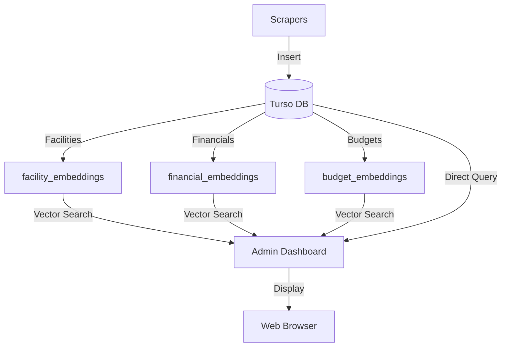

# Turso Integration - Unified Database

All data goes into **ONE Turso database** - the vector search extends your existing Hippocratic database.

## 🗄️ Single Database Architecture

```
hippocratic-db (Turso)
├── Existing Tables (from populate_db.py):
│   ├── facilities
│   ├── financials
│   ├── observations
│   ├── duplicate_groups
│   ├── facility_duplicates
│   ├── data_sources
│   ├── ingestion_logs
│   └── government_budgets
│
└── New Vector Tables (from turso_vector_setup.sql):
    ├── facility_embeddings       ← Links to facilities.id
    ├── financial_embeddings      ← Links to financials.id
    ├── budget_embeddings         ← Links to government_budgets.id
    ├── fraud_patterns            ← Pre-seeded fraud indicators
    ├── search_cache              ← Query optimization
    └── vector_metadata           ← Embedding stats
```

## 🔗 How Tables Connect

```sql
-- Facilities with their vector embeddings
SELECT 
    f.name,
    f.address,
    fe.embedding,
    fe.similarity_score
FROM facilities f
JOIN facility_embeddings fe ON f.id = fe.facility_id

-- Financial records with embeddings
SELECT 
    fin.license_number,
    fin.hospice_total_revenue,
    fne.embedding
FROM financials fin
JOIN financial_embeddings fne ON fin.id = fne.financial_id

-- Budget records with embeddings
SELECT 
    gb.department,
    gb.actual_amount,
    be.embedding
FROM government_budgets gb
JOIN budget_embeddings be ON gb.id = be.budget_id
```

## 🚀 Setup (One Database)

### Local Development

```bash
# 1. Your existing database already has data
sqlite3 local.db "SELECT COUNT(*) FROM facilities"
# Output: 5432

# 2. Add vector tables to SAME database
sqlite3 local.db < turso_vector_setup.sql

# 3. Verify new tables
sqlite3 local.db "SELECT name FROM sqlite_master WHERE type='table'"
# Output includes: facilities, financials, facility_embeddings, etc.

# 4. Generate embeddings (uses same DB)
python vector_search.py --embed-all --db local.db

# 5. Admin server (uses same DB)
python hippocratic_admin.py
```

### Turso Cloud (Production)

```bash
# 1. You already have a Turso database
turso db list
# hippocratic-db (active)

# 2. Add vector tables to SAME Turso database
turso db shell hippocratic-db < turso_vector_setup.sql

# 3. Verify tables
turso db shell hippocratic-db "SELECT name FROM sqlite_master WHERE type='table'"

# 4. Update .env to use Turso
cat > .env << EOF
TURSO_DATABASE_URL=libsql://hippocratic-db.turso.io
TURSO_AUTH_TOKEN=your-token-here
EOF

# 5. Generate embeddings (writes to Turso)
python vector_search.py --embed-all --db "\$TURSO_DATABASE_URL"

# 6. Admin server (reads from Turso)
python hippocratic_admin.py
```

## 🔧 Database Configuration

### Option 1: Local SQLite (Development)

```python
# vector_search.py
vs = VectorSearch(db_path="local.db")

# hippocratic_admin.py automatically uses local.db
admin = HippocraticAdmin()
```

### Option 2: Turso Cloud (Production)

```python
# .env file
TURSO_DATABASE_URL=libsql://hippocratic-db.turso.io
TURSO_AUTH_TOKEN=eyJhbGc...

# vector_search.py will use libsql client
vs = VectorSearch(db_path=os.getenv("TURSO_DATABASE_URL"))

# Admin server reads from Turso
admin = HippocraticAdmin()  # Automatically detects Turso from env
```

### Option 3: Hybrid (Dev + Prod)

```bash
# Development: Local SQLite
python hippocratic_admin.py

# Production: Turso Cloud
export TURSO_DATABASE_URL="libsql://hippocratic-db.turso.io"
export TURSO_AUTH_TOKEN="your-token"
python hippocratic_admin.py
```

## 📊 Data Flow



## 🔍 Querying Combined Data

### Semantic Search with Original Data

```python
from vector_search import VectorSearch

vs = VectorSearch(db_path="local.db")  # Or Turso URL

# Search returns facilities with all their data
results = vs.search_facilities("hospice in Los Angeles")

for result in results:
    # Has facility data + similarity score
    print(f"{result['name']} - {result['address']}")
    print(f"Similarity: {result['similarity']:.3f}")
    print(f"License: {result.get('license_number', 'N/A')}")
```

### Direct SQL (Combined Tables)

```python
import sqlite3

conn = sqlite3.connect("local.db")

# Get facilities with high-similarity embeddings
cursor = conn.execute("""
    SELECT 
        f.id,
        f.name,
        f.address,
        f.city,
        fin.hospice_total_revenue,
        fe.text_content as embedded_text,
        COUNT(fd.facility_id) as duplicate_count
    FROM facilities f
    JOIN facility_embeddings fe ON f.id = fe.facility_id
    LEFT JOIN financials fin ON f.license_number = fin.license_number
    LEFT JOIN facility_duplicates fd ON f.id = fd.facility_id
    WHERE fin.hospice_total_revenue > 1000000
    GROUP BY f.id
    ORDER BY duplicate_count DESC
""")

for row in cursor.fetchall():
    print(row)
```

## 🔒 Single Source of Truth

**Benefits of One Database:**

✅ **No Sync Issues** - All data in one place  
✅ **Join Queries** - Combine vectors with original data  
✅ **Atomic Updates** - Transactions across all tables  
✅ **Simpler Deployment** - One connection string  
✅ **Unified Backups** - One database to backup  
✅ **Cost Efficient** - One Turso database  

## 📈 Turso Cloud Deployment

### Complete Setup

```bash
# 1. Create Turso database (if not exists)
turso db create hippocratic-db

# 2. Apply ALL schemas (existing + vector)
cat > full_schema.sql << EOF
-- Existing tables (from your populate_db.py)
$(cat data_sources/schema.sql)

-- Vector tables (new)
$(cat turso_vector_setup.sql)
EOF

turso db shell hippocratic-db < full_schema.sql

# 3. Get connection details
turso db show hippocratic-db

# 4. Set environment variables
export TURSO_DATABASE_URL="libsql://hippocratic-db.turso.io"
export TURSO_AUTH_TOKEN="$(turso db tokens create hippocratic-db)"

# 5. Populate existing data
python populate_db.py  # Uses Turso

# 6. Generate embeddings
python vector_search.py --embed-all  # Uses Turso

# 7. Start admin
python hippocratic_admin.py  # Uses Turso
```

## 🔄 Migration Path

### From Local to Turso

```bash
# 1. Export local database
sqlite3 local.db .dump > hippocratic_full.sql

# 2. Import to Turso
turso db shell hippocratic-db < hippocratic_full.sql

# 3. Verify
turso db shell hippocratic-db "SELECT COUNT(*) FROM facilities"
turso db shell hippocratic-db "SELECT COUNT(*) FROM facility_embeddings"

# 4. Update code to use Turso
# (Automatically detects TURSO_DATABASE_URL env var)
```

## 🎯 Example: Admin Server Using Unified DB

```python
# hippocratic_admin.py

class HippocraticAdmin:
    def __init__(self):
        # Single database connection
        if os.getenv("TURSO_DATABASE_URL"):
            # Production: Turso
            self.db = create_client(os.getenv("TURSO_DATABASE_URL"))
        else:
            # Development: Local
            self.db = sqlite3.connect("local.db")
    
    def get_stats(self):
        # Query both regular and vector tables
        return {
            'facilities': self.db.execute("SELECT COUNT(*) FROM facilities"),
            'embeddings': self.db.execute("SELECT COUNT(*) FROM facility_embeddings"),
            'fraud_patterns': self.db.execute("SELECT COUNT(*) FROM fraud_patterns")
        }
```

## ✅ Verification

```bash
# Check all tables exist in one database
sqlite3 local.db << EOF
SELECT 
    name, 
    type,
    CASE 
        WHEN name LIKE '%embedding%' THEN 'VECTOR'
        WHEN name LIKE 'fraud_patterns' THEN 'VECTOR'
        ELSE 'CORE'
    END as table_type
FROM sqlite_master 
WHERE type='table'
ORDER BY table_type, name;
EOF

# Output:
# facilities              table  CORE
# financials              table  CORE
# government_budgets      table  CORE
# data_sources            table  CORE
# facility_embeddings     table  VECTOR
# financial_embeddings    table  VECTOR
# budget_embeddings       table  VECTOR
# fraud_patterns          table  VECTOR
```

## 🌐 Production Architecture

```
┌─────────────────────────────────────────┐
│         Turso Cloud Database            │
│         hippocratic-db.turso.io         │
├─────────────────────────────────────────┤
│ Core Tables:                            │
│  • facilities (5,432 records)           │
│  • financials (8,901 records)           │
│  • government_budgets (2,341)           │
│  • data_sources (45)                    │
│                                         │
│ Vector Tables:                          │
│  • facility_embeddings (5,432)          │
│  • financial_embeddings (8,901)         │
│  • fraud_patterns (8)                   │
│  • search_cache (auto)                  │
└─────────────────────────────────────────┘
         ↑                    ↑
         │                    │
    ┌────┴────┐          ┌───┴────┐
    │ Scrapers│          │ Admin  │
    │ (write) │          │ Server │
    └─────────┘          └────────┘
```

## 📝 Summary

**One Database, Multiple Capabilities:**
- ✅ Same Turso database for everything
- ✅ Vector tables extend existing schema
- ✅ Foreign keys maintain relationships
- ✅ Admin server queries both regular + vector data
- ✅ Scrapers write to core tables
- ✅ Vector search generates embeddings on-demand
- ✅ No synchronization needed
- ✅ Single source of truth

**Environment Detection:**
```python
# Code automatically detects:
if TURSO_DATABASE_URL:
    use_turso()
else:
    use_local_sqlite()
```

---

**One Database. Full Power.** 🚀
